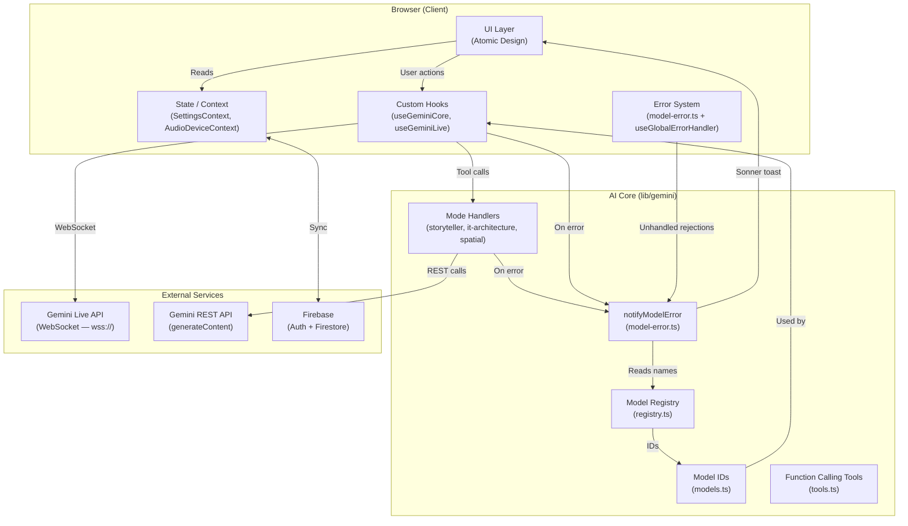
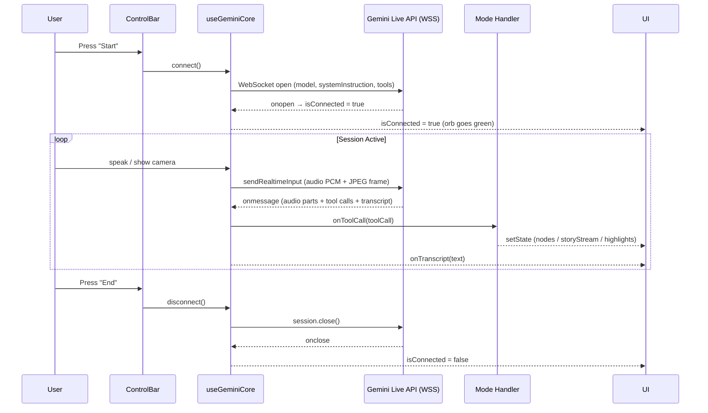
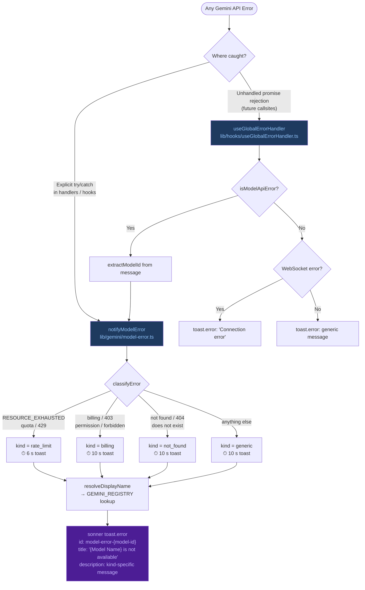
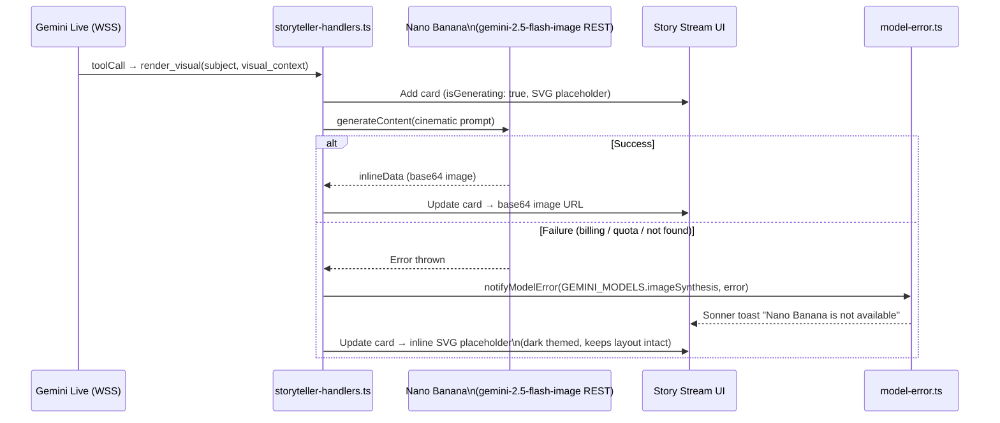
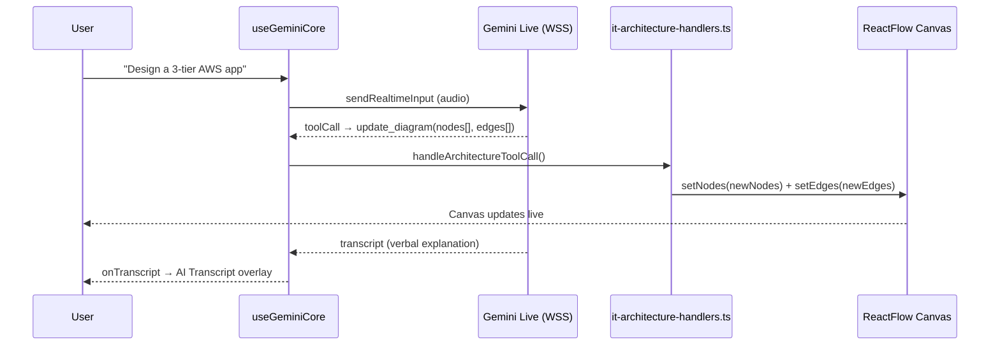
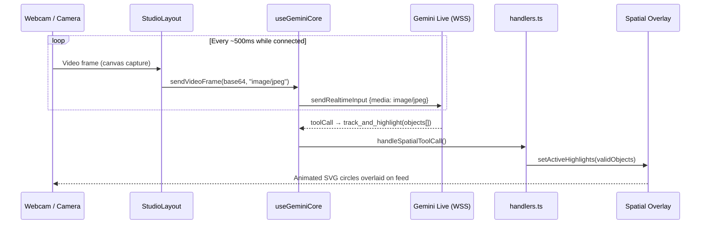
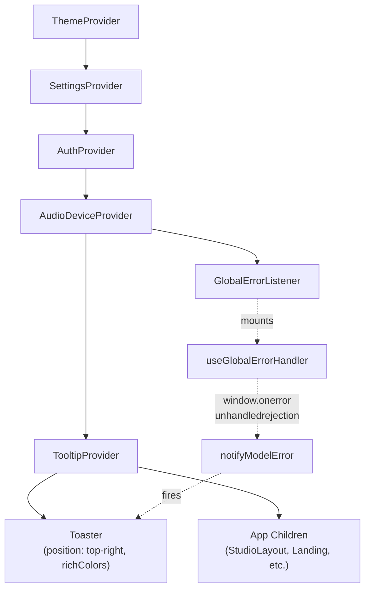
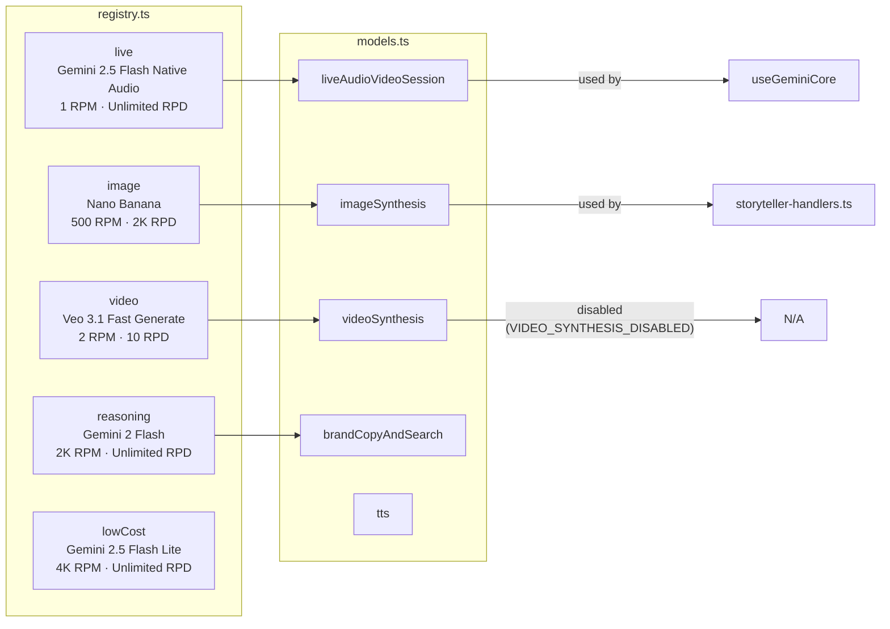

# Architecture Diagrams — The Spatial Eye

> **Source of truth** for all system data flows in the application.
> Generated: 2026-02-20

---

## 1. High-Level System Overview

---

## 2. Gemini Live Session Flow (All Modes)

---

## 3. Error Handling & Model Notification System

### Error Classification Reference

| `kind` | Triggers | Toast Duration |
|--------|----------|----------------|
| `rate_limit` | `RESOURCE_EXHAUSTED`, `quota`, `rate`, `429`, `too many requests` | 6 s |
| `billing` | `billing`, `403`, `permission`, `forbidden`, `access denied` | 10 s |
| `not_found` | `not found`, `404`, `does not exist` | 10 s |
| `generic` | Everything else | 10 s |

### Coverage Points in `useGeminiCore.ts`

| Hook Path | Error Source | Action |
|-----------|-------------|--------|
| `checkModelAvailability` | HTTP 403 / invalid key | `notifyModelError` + `modelAvailability = "unavailable"` |
| `onerror` callback | SDK error during session | `notifyModelError` + `modelAvailability = "unavailable"` |
| `onclose` (code 1008) | WS policy violation (billing) | `notifyModelError` + `modelAvailability = "unavailable"` |
| `.catch` on connect | Network/auth failure | `notifyModelError` + `modelAvailability = "unavailable"` |

---

## 4. Storyteller Mode — Image Generation Flow

---

## 5. IT Architecture Mode — Diagram Update Flow

---

## 6. Spatial Mode — Object Detection Flow

---

## 7. Provider / Context Tree

---

## 8. Model Registry

---

## Key File Map

| File | Role |
|------|------|
| `lib/gemini/model-error.ts` | Centralized error classification + toast |
| `lib/gemini/registry.ts` | Model metadata / display names |
| `lib/gemini/models.ts` | Resolved model ID constants |
| `lib/hooks/useGeminiCore.ts` | Live WebSocket session management |
| `lib/hooks/useGlobalErrorHandler.ts` | Window-level unhandled error/rejection handler |
| `lib/gemini/handlers.ts` | Spatial mode tool call handler |
| `lib/gemini/storyteller-handlers.ts` | Storyteller mode tool calls + image gen |
| `lib/gemini/it-architecture-handlers.ts` | IT Architecture mode tool calls |
| `components/providers.tsx` | Context tree + GlobalErrorListener mount |
| `components/ui/sonner.tsx` | Toast renderer (Sonner, top-right, richColors) |
