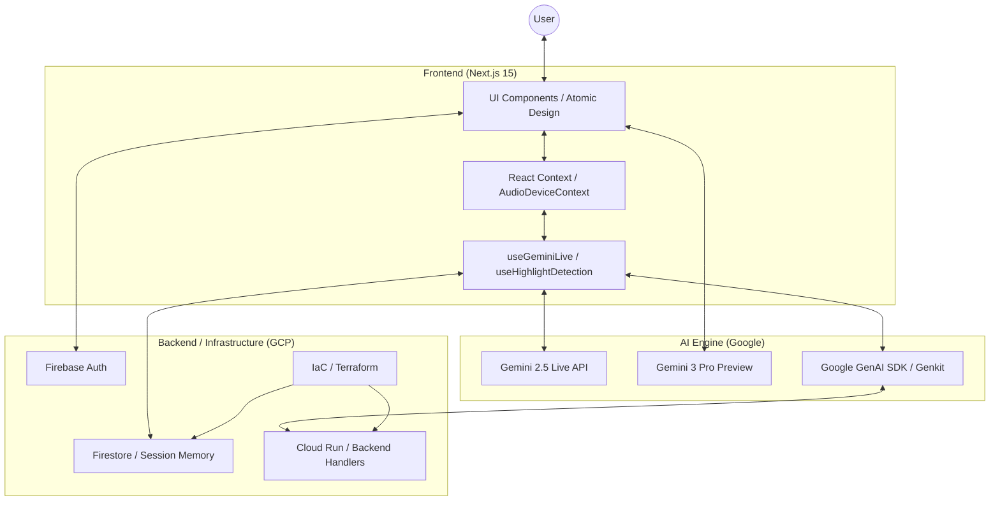

# Hakentoch Ready Checklist

This document evaluates "The Spatial Eye" against the "Gemini Live Agent Challenge" (Hakentoch) requirements outlined in `hakentoch.md`.

## Compliance Status: **In Progress**

### 1. Eligibility & Constraints
- [x] **New Project**: Project appears to be a new creation.
- [x] **Gemini Model**: Uses `gemini-2.5-flash-native-audio-preview` and `gemini-2.5-flash-image`.
- [x] **Google Cloud Hosted**: Uses Firebase (GCP).
- [x] **Proof of Deployment**: `IaC/terraform` configuration provided (Terraform).

### 2. Challenge Categories (Select One)
The project seems best suited for **Live Agents** or **Creative Storyteller**.
- **Live Agents**: Real-time interaction (Audio/Video). Current implementation using `useGeminiLive` aligns well.
- **Creative Storyteller**: Multimodal storytelling. Functional if "Storyteller" mode works as intended with interleaved output.
- **UI Navigator**: Not currently implemented.

### 3. Submission Requirements (Gap Analysis)
| Requirement | Status | Action Needed |
| :--- | :--- | :--- |
| **Text Description** | ✅ Ready | See [SUMMARY.md](file:///i:/01-Master_Code/Apps/The%20Spatial%20Eye/docs/SUMMARY.md) |
| **Public Repo** | ✅ Ready | Ensure `.env` is ignored. |
| **Spin-up Instructions** | ⚠️ Partial | `README.md` has basics, but needs "Cloud Deployment" steps. |
| **Proof of GCP** | ✅ Ready | Included in [IaC/terraform](file:///i:/01-Master_Code/Apps/The%20Spatial%20Eye/IaC/terraform/main.tf). |
| **Architecture Diagram** | ✅ Ready | Visualized below. |

### System Architecture

| **Demo Video** | ❌ Missing | Record a <4 min video showing the "Live" and "Storyteller" modes. |

### 4. Bonus Opportunities (High Priority)
- [x] **Automated Cloud Deployment**:
    -   **Status**: Complete.
    -   **Implementation**: `IaC/terraform` and `IaC/pulumi` directories created.
    -   **Features**: Cloud Run, Artifact Registry, Firebase Project, Firestore Native (Free Tier compliant).
- [x] **High-Impact Landing Page**:
    -   **Status**: Complete.
    -   **Implementation**: A modern, particle-animated landing page as the root `/`.
- [ ] **Content Piece**:
    -   **Missing**: A blog post or video explaining "How we built it". (Landing page text serves as draft content).
- [ ] **GDG Membership**:
    -   **Action**: Ensure team members join a local Google Developer Group and include profile links.

## Immediate Next Steps
1.  **Terraform Setup**: Create a `main.tf` to define the GCP project and Firebase resources.
2.  **Architecture Diagram**: Generate a Mermaid diagram in `architecture.md`.
3.  **Demo Video**: Script and record the walkthrough.
