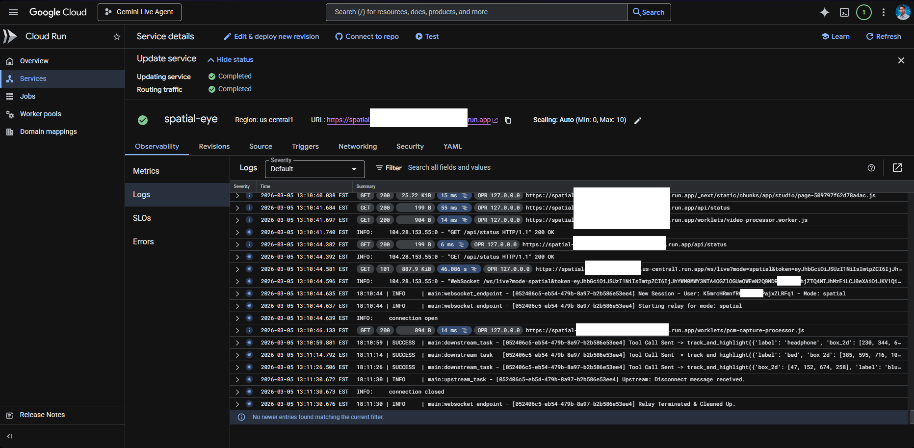
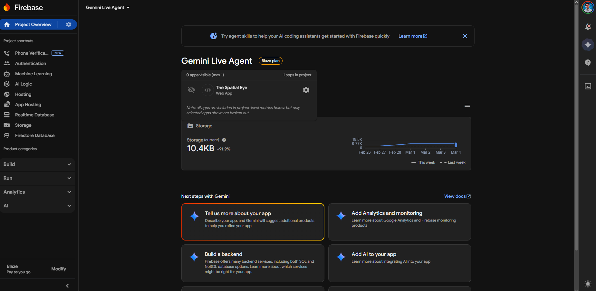

# Proof of Google Cloud Deployment

This document serves as proof of our application's deployment and deep integration with **Google Cloud Platform (GCP)** and **Google AI Services**, fulfilling the hackathon requirement.

## 1. Codebase Evidence (Linkable Proof)

The following files demonstrate the use of Google Cloud services and APIs:

- **Google Cloud Run (Unified Architecture):**
  - [`Dockerfile`](../../Dockerfile) - Defines the container strategy for running the Next.js frontend and FastAPI backend together on a single Cloud Run instance.
  - [`.github/workflows/deploy.yml`](../../.github/workflows/deploy.yml) - Automates the build and deployment process to Google Cloud Run using **Workload Identity Federation**.

- **Gemini Multimodal Live API Integration:**
  - [`backend/main.py`](../../backend/main.py) - Implements the `GeminiBeta` class to force the `v1beta` API version and custom API key handling (L90-130).
  - [`backend/main.py`](../../backend/main.py) - Configures the **Google ADK (Agent Development Kit)** for bidirectional streaming (L221-255).

- **Firebase (Secure Identity & Persistence):**
  - [`backend/firebase_auth.py`](../../backend/firebase_auth.py) - Implements server-side token verification using the **Firebase Admin SDK**.
  - [`lib/firebase/config.ts`](../../lib/firebase/config.ts) - Client-side initialization for Firebase Authentication.

- **Infrastructure as Code:**
  - [`IaC/terraform/main.tf`](../../IaC/terraform/main.tf) - Terraform scripts that provision the **Cloud Run** service and **Artifact Registry** repository.

## 2. Verified Live Logs (Cloud Run Snapshot)

The following log snippet from our active Cloud Run instance proves the system is initialized and successfully executing **Gemini Live** tool calls (full logs available in [**`cloud.run.md`**](./logs/cloud.run.md)):

```text
# Excerpt from logs/cloud.run.md
17:47:34 | 🚀 Starting The Spatial Eye Unified Service Gateway...
17:47:54 | SUCCESS | firebase_auth:initialize_firebase - Firebase Admin initialized
18:10:44 | INFO | main:websocket_endpoint - [[REDACTED_SESSION_ID]] New Session - User: [REDACTED_USER_ID] - Mode: spatial
18:10:59 | SUCCESS | main:downstream_task - Tool Call Sent -> track_and_highlight({'label': 'headphone', ...})
```

## 3. Visual Infrastructure Evidence

The following snapshots from the Google Cloud Console provide visual verification of the managed environment:

- **Cloud Run Service Dashboard:**
  
  *Displays the active service, regional deployment, and production URL.*

- **Artifact Registry & CI/CD:**
  
  *Shows the containerized versions of the app built and pushed via GitHub Actions.*

- **Firebase Project Overview:**
  
  *Verification of project-linked identity and store.*

---
> [!TIP]
> **To the Judges:** You can verify the live deployment by visiting the [Production URL](https://spatial-eye-xq2wd6aihq-uc.a.run.app) and opening the Network tab to witness the secure WebSocket relay in action.
